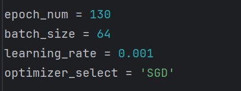
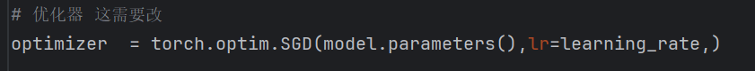
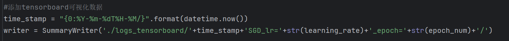

## 如何进行实验
### 1.下载没有的依赖和数据集，一般就行了。
### 2.修改参数（可增可改）

### 3.修改优化器

### 4.(可选)修改tensorflow信息(主要是保存实验的各种设置-优化器，学习率，动量项等，方便识别)

### 5.(可选)改你想改的任何代码
## 如何查看实验结果
### 1.```pip install tensorboard```
### 2.终端中输入```tensorboard --logdir=logs_tensorboard```(存储实验结果的文件夹)

## 2024.12.13
### 1.加入多个新实验
* SDM、Adam、Momentum、RMSprop、Adamax 在batchsize=128，lr=0.001，epoch=130（其余默认）时的基础实验 **（重点是验证batchsize的增加-从64到128，曲线的振荡情况是否会减轻）**
* 并且加入了训练集loss曲线（每一个epoch记录一次）和测试集loss曲线（之前只是把每次迭代batch的loss累加，现在计算了平均）
* 加入Adam、momentum、RMSprop 在batchsize=128，lr=0.01（其余不变）的实验结果
* 加入Adamax在batchsize=128，lr=0.01（其余不变）的实验结果

## 2024.12.15
### 1.重做Batchsize=64的实验
* 主要是增加每个优化器的训练集loss曲线（per epoch）以及测试集平均损失曲线
* 发现部分优化器比一开始的实验波动更大了点，特别是SGD下限会更低，曲线更抖--没设置random seed等
